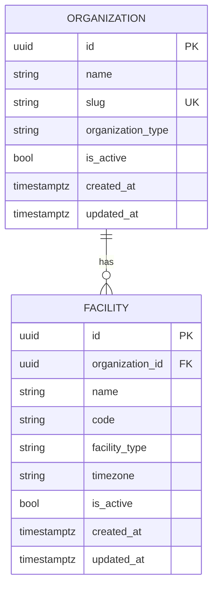

# AgentCare Domain Model

This document describes AgentCare's domain persistence model as of
STORY-003 (Organization & Facility Tenancy Foundation). It follows the
same CURRENT vs. PLANNED discipline as [ARCHITECTURE.md](ARCHITECTURE.md)
and [DATABASE.md](DATABASE.md): everything described here as implemented
exists in the repository and the database schema today; anything marked
PLANNED does not yet.

No CRUD API exists for these entities. This story establishes domain
persistence only — routes/services/repositories come in a later story.

## 1. Tenant Hierarchy



```
Organization (tenant boundary)
  └── Facility (physical/operational location)
```

**Organization** is AgentCare's tenant boundary — it represents the
customer (a hospital, clinic, hospital group, or other healthcare provider
organization). **Facility** represents a physical or operational location
belonging to exactly one Organization. Nothing below Facility (staff,
patients, appointments, etc.) exists yet — see Section 12.

## 2. Organization

`app/models/organization.py` — table `organizations`.

| Column | Type | Constraints |
|---|---|---|
| `id` | UUID | primary key, application-generated (`uuid.uuid4`) |
| `name` | VARCHAR(255) | NOT NULL |
| `slug` | VARCHAR(100) | NOT NULL, UNIQUE |
| `organization_type` | VARCHAR(32) | NOT NULL, CHECK constrained to `OrganizationType` |
| `is_active` | BOOLEAN | NOT NULL, default `true` |
| `created_at` | TIMESTAMPTZ | NOT NULL |
| `updated_at` | TIMESTAMPTZ | NOT NULL |

`slug` is the stable, URL/API-friendly identifier for an organization
(distinct from its display `name`, which can change without breaking
references). Both are required — an organization must have both a human
name and a slug from creation.

## 3. Facility

`app/models/facility.py` — table `facilities`.

| Column | Type | Constraints |
|---|---|---|
| `id` | UUID | primary key, application-generated |
| `organization_id` | UUID | NOT NULL, FK → `organizations.id` (`ON DELETE RESTRICT`), indexed |
| `name` | VARCHAR(255) | NOT NULL |
| `code` | VARCHAR(50) | NOT NULL, UNIQUE together with `organization_id` |
| `facility_type` | VARCHAR(32) | NOT NULL, CHECK constrained to `FacilityType` |
| `timezone` | VARCHAR(64) | NOT NULL, validated as a real IANA timezone at the application layer |
| `is_active` | BOOLEAN | NOT NULL, default `true` |
| `created_at` | TIMESTAMPTZ | NOT NULL |
| `updated_at` | TIMESTAMPTZ | NOT NULL |

`code` is scoped to its organization, not global: two different
organizations may each have a facility coded `"MAIN"`; the same
organization may not have two facilities both coded `"MAIN"`. See Section
7.

No address or contact-information fields exist yet — deliberately, per
this story's scope. They can be added in a later migration once there's a
concrete requirement driving their shape, rather than guessed at now.

## 4. Identifiers

Both models use **UUID primary keys generated in the application**
(`uuid.uuid4()`, via `UUIDPrimaryKeyMixin` — see
[DATABASE.md](DATABASE.md)), not database-generated ids (e.g. Postgres
`gen_random_uuid()`) and not auto-incrementing integers. This is portable
across database backends and makes the id known before the row is
inserted (useful once services/workflows need to reference an id before
committing). There is no compelling PostgreSQL-specific reason to prefer
server-side generation for these two entities.

## 5. Ownership: The Tenant Boundary

**Organization is AgentCare's tenant boundary.** Every future tenant-owned
entity (staff, patients, appointments, documents, workflows, etc. — none
of which exist yet) is expected to carry `organization_id`, either
directly as a column (like `Facility`) or through an explicit ownership
path (e.g. a future `Appointment` might reach its organization via
`Appointment.facility.organization_id` rather than duplicating the column
on every table). See ADR-0003 for the full tenancy decision record.

**What this story enforces, and what it doesn't:**

- **Enforced now, at the database/model level:** `Facility.organization_id`
  is a required, indexed foreign key with `ON DELETE RESTRICT` — a
  facility can never exist without a valid, still-existing organization,
  and an organization with facilities can never be deleted out from under
  them by accident (Section 7).
- **NOT implemented yet:** there is no global, automatic "tenant filter"
  that transparently scopes every query to the current user's
  organization. No such magic exists in STORY-003, and none is planned to
  be bolted on as an afterthought — see ADR-0003's Decision and
  Consequences for why, and where that responsibility will actually live
  (repositories/services/auth context, in a later story).

## 6. Enum Strategy

`OrganizationType` and `FacilityType` (both `enum.StrEnum`, defined in
their respective model modules) are deliberately small, initial sets:

- `OrganizationType`: `hospital`, `clinic`, `hospital_group`,
  `healthcare_provider`
- `FacilityType`: `hospital`, `clinic`, `diagnostic_center`, `other`

**Persistence strategy**: both are mapped with SQLAlchemy's `Enum` type
using `native_enum=False` (persisted as `VARCHAR` rather than a native
PostgreSQL `ENUM` type) plus `create_constraint=True` (a real database
`CHECK` constraint restricting the column to the enum's values —
verified against real PostgreSQL, e.g.
`ck_organizations_organization_type`). `values_callable` is set so the
*persisted* value is each member's lowercase `.value` (e.g. `"hospital"`),
not its uppercase Python member name (`"HOSPITAL"`) — SQLAlchemy's
default behavior for enum columns, easy to get wrong.

**Why `native_enum=False` instead of a native PostgreSQL `ENUM` type**:
adding a new value to a native PG enum requires `ALTER TYPE ... ADD
VALUE`, which has awkward transactional restrictions (in particular, the
new value can't be used in the same transaction it was added in on older
PostgreSQL versions). A `VARCHAR` + `CHECK` constraint gets the same
real enforcement, but expanding it later is an ordinary migration that
alters the constraint — no special-cased DDL.

**Enum expansion is a controlled schema + application change, not a
free-form string field**: adding a value means (1) adding it to the
Python `StrEnum`, (2) an Alembic migration altering the `CHECK`
constraint, and (3) an application release. A caller can never persist an
arbitrary string — every insert is checked against the current allowed
set, at the database level, regardless of whether it goes through the ORM
or raw SQL (verified in `tests/models/`).

## 7. Constraints & Indexes

| Constraint | Table | Purpose |
|---|---|---|
| `uq_organizations_slug` | `organizations` | Organization slugs are globally unique |
| `ck_organizations_organization_type` | `organizations` | Restricts `organization_type` to `OrganizationType`'s values |
| `fk_facilities_organization_id_organizations` (`ON DELETE RESTRICT`) | `facilities` | Every facility must reference a real, still-existing organization |
| `uq_facilities_organization_id_code` | `facilities` | Facility `code` is unique **within** an organization, not globally |
| `ck_facilities_facility_type` | `facilities` | Restricts `facility_type` to `FacilityType`'s values |
| `ix_facilities_organization_id` | `facilities` | Supports the expected "all facilities for this organization" lookup |

No indexes were added mechanically to every column — only
`organization_id` on `facilities` is indexed on its own (beyond what the
unique constraints already index), because "list an organization's
facilities" is a genuinely expected access pattern; nothing else in this
story has an identified lookup pattern that justifies one yet.

## 8. Relationships & Cascade Behavior

`Organization.facilities` ↔ `Facility.organization` is a standard
SQLAlchemy 2.x typed `relationship()` pair (`back_populates` on both
sides).

**Cascade behavior is deliberately conservative**: the relationship uses
SQLAlchemy's default cascade (`"save-update, merge"`) — it does **not**
include `"delete"` or `"delete-orphan"`. An ORM `session.delete(some_org)`
will never silently cascade-delete that organization's facilities. The
actual enforcement point is the database foreign key itself
(`ON DELETE RESTRICT`, Section 3): PostgreSQL will refuse the delete
outright if any facility still references that organization, raising an
`IntegrityError`. `passive_deletes=True` on the relationship tells
SQLAlchemy to rely on that database behavior rather than loading and
manipulating the whole `facilities` collection itself when a parent is
deleted.

Net effect: deleting an organization that still has facilities always
fails, loudly, rather than silently deleting everything underneath it or
silently doing nothing. Nothing in this story implements a deliberate
"delete an organization and everything under it" operation — that would
be a conscious future decision, not an accidental side effect of calling
`session.delete()`.

## 9. Lifecycle Semantics

`is_active` (on both `Organization` and `Facility`) is a **business
status flag**, not soft deletion. There is no query-level filtering that
automatically hides inactive rows, no deleted-at timestamp, and no
soft-delete behavior implemented anywhere in this story. A row with
`is_active=False` is exactly as present, queryable, and referenceable as
one with `is_active=True` — what `is_active` means operationally (e.g.
whether inactive organizations can still be looked up by future services)
is not decided by this story and is left to the layer that actually
consumes it.

`created_at`/`updated_at` (via `TimestampMixin` — see
[DATABASE.md](DATABASE.md)) are set in Python, UTC, timezone-aware.
`updated_at` only refreshes for updates made through this ORM's `Session`
— a caveat inherited from the mixin, documented there.

## 10. Testing Strategy (Domain Models)

Organization/Facility tests (`backend/tests/models/`) run exclusively
against **real PostgreSQL** (skipped unless `AGENTCARE_TEST_POSTGRES_URL`
is set), not SQLite — because nearly everything meaningful about these
models (`UNIQUE`, the composite `UNIQUE(organization_id, code)`, the FK's
`ON DELETE RESTRICT`, the `CHECK` constraints, enum persistence) is
constraint-level, database-enforced behavior that SQLite either doesn't
enforce the same way or doesn't have an equivalent syntax for at all. Each
test runs inside a savepoint that's always rolled back afterward (see
`tests/models/conftest.py`), so no synthetic test data is ever actually
committed to the shared development database. Coverage includes: UUID
generation, required-field enforcement, slug/composite-code uniqueness,
cross-organization code reuse, enum persistence and round-tripping, a
direct raw-SQL proof that the `CHECK` constraints are real (not just
`SQLAlchemy`-side validation), timezone persistence and application-level
timezone validation, `is_active` defaults, and timestamp behavior.

## 11. Current vs. Planned Entities

**Current (this story):** `Organization`, `Facility`.

**Explicitly not implemented in this story** (per STORY-003's scope —
these belong to later stories): `User`/authentication, RBAC, `Patient`,
`Department`, `Doctor`, `Appointment`, `Document`, `WorkflowRun`, any
audit system, agents, tools, and any CRUD API for `Organization` or
`Facility` themselves.

## 12. Planned Direction (NOT Implemented)

- A **service/repository layer** in front of these models (see
  `docs/ARCHITECTURE.md` Section 4) — nothing queries or writes these
  tables yet except the tests.
- **Authorization/tenant-scoping enforcement** at the repository/service
  or auth-context layer, per ADR-0003 — not a schema-level concern beyond
  what Section 5 already establishes.
- Further domain entities nested under `Facility` or `Organization`
  (staff, patients, appointments, documents) — introduced by later
  stories as their own foundational work, not guessed at here.
- Soft deletion, if ever needed, would be a deliberate future decision
  with its own ADR — not implied by `is_active` (Section 9).
