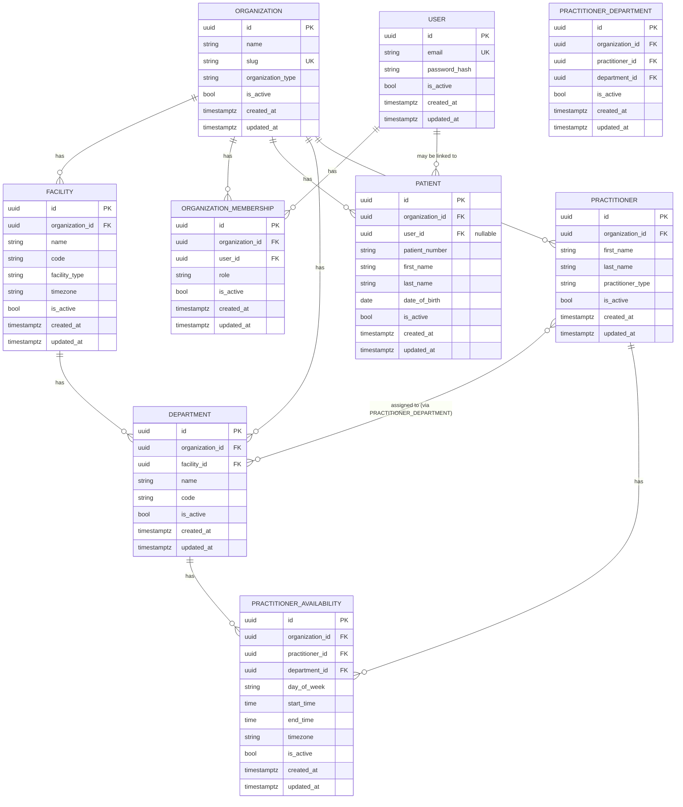

# AgentCare Domain Model

This document describes AgentCare's domain persistence model as of
STORY-006 (Department, Practitioner & Availability Foundation), building
on STORY-005 (Patient Domain, Self-Access & Tenant-Safe API), STORY-004
(Identity, Membership & RBAC Foundation), and STORY-003 (Organization &
Facility Tenancy Foundation). It follows the same CURRENT vs. PLANNED
discipline as [ARCHITECTURE.md](ARCHITECTURE.md) and
[DATABASE.md](DATABASE.md): everything described here as implemented
exists in the repository and the database schema today; anything marked
PLANNED does not yet.

No CRUD API exists for `Organization`/`Facility`. A minimal, focused auth
API exists for identity (`POST /api/v1/auth/token`, `GET /api/v1/auth/me`
— see [RBAC.md](RBAC.md)). Tenant-scoped, RBAC-protected APIs exist for
`Patient` (see [PATIENTS.md](PATIENTS.md)) and for `Department`/
`Practitioner`/availability (see
[SCHEDULING_RESOURCES.md](SCHEDULING_RESOURCES.md)). Routes/services/
repositories for `Organization`/`Facility` themselves still don't exist;
they come in a later story.

## 1. Tenant Hierarchy & Identity



```
Organization (tenant boundary)
  ├── Facility (physical/operational location)
  │     └── Department (administrative scheduling unit)
  │           ↕ (many-to-many via PractitionerDepartment)
  │          Practitioner (schedulable healthcare professional)
  │                └── PractitionerAvailability (recurring weekly window,
  │                    per Practitioner+Department pairing)
  ├── OrganizationMembership (a User's role within this Organization)
  │     ↑
  │    User (global identity — may hold memberships in multiple Organizations)
  └── Patient (administrative patient record, owned by this Organization)
        ↑ (optional)
       User (a Patient MAY be linked to a portal User identity)
```

**Organization** is AgentCare's tenant boundary — it represents the
customer (a hospital, clinic, hospital group, or other healthcare provider
organization). **Facility** represents a physical or operational location
belonging to exactly one Organization. **User** is a global identity, not
scoped to any one Organization. **OrganizationMembership** is the join
between a `User` and an `Organization`, carrying the `Role` that governs
what that user can do *within that organization* — see
[RBAC.md](RBAC.md) for the full identity/authorization model. **Patient**
(STORY-005) is an ADMINISTRATIVE patient record belonging to exactly one
Organization, optionally linked to a `User` — see [PATIENTS.md](PATIENTS.md)
for the full patient domain model. **Department** (STORY-006) is an
administrative scheduling unit belonging to exactly one Facility (and,
transitively, its Organization). **Practitioner** (STORY-006) is a
schedulable healthcare professional belonging to exactly one Organization,
related to Department many-to-many via **PractitionerDepartment**.
**PractitionerAvailability** (STORY-006) is a recurring weekly
availability window for one Practitioner within one Department — see
[SCHEDULING_RESOURCES.md](SCHEDULING_RESOURCES.md) for the full
scheduling-resource model. Nothing further below this (appointments,
documents, etc.) exists yet — see Section 19.

## 2. Organization

`app/models/organization.py` — table `organizations`.

| Column | Type | Constraints |
|---|---|---|
| `id` | UUID | primary key, application-generated (`uuid.uuid4`) |
| `name` | VARCHAR(255) | NOT NULL |
| `slug` | VARCHAR(100) | NOT NULL, UNIQUE |
| `organization_type` | VARCHAR(32) | NOT NULL, CHECK constrained to `OrganizationType` |
| `is_active` | BOOLEAN | NOT NULL, default `true` |
| `created_at` | TIMESTAMPTZ | NOT NULL |
| `updated_at` | TIMESTAMPTZ | NOT NULL |

`slug` is the stable, URL/API-friendly identifier for an organization
(distinct from its display `name`, which can change without breaking
references). Both are required — an organization must have both a human
name and a slug from creation.

## 3. Facility

`app/models/facility.py` — table `facilities`.

| Column | Type | Constraints |
|---|---|---|
| `id` | UUID | primary key, application-generated |
| `organization_id` | UUID | NOT NULL, FK → `organizations.id` (`ON DELETE RESTRICT`), indexed |
| `name` | VARCHAR(255) | NOT NULL |
| `code` | VARCHAR(50) | NOT NULL, UNIQUE together with `organization_id` |
| `facility_type` | VARCHAR(32) | NOT NULL, CHECK constrained to `FacilityType` |
| `timezone` | VARCHAR(64) | NOT NULL, validated as a real IANA timezone at the application layer |
| `is_active` | BOOLEAN | NOT NULL, default `true` |
| `created_at` | TIMESTAMPTZ | NOT NULL |
| `updated_at` | TIMESTAMPTZ | NOT NULL |

`code` is scoped to its organization, not global: two different
organizations may each have a facility coded `"MAIN"`; the same
organization may not have two facilities both coded `"MAIN"`. See Section
10.

No address or contact-information fields exist yet — deliberately, per
this story's scope. They can be added in a later migration once there's a
concrete requirement driving their shape, rather than guessed at now.

## 4. User

`app/models/user.py` — table `users`. See [RBAC.md](RBAC.md) for the
full identity/authentication model this table backs.

| Column | Type | Constraints |
|---|---|---|
| `id` | UUID | primary key, application-generated |
| `email` | VARCHAR(255) | NOT NULL, UNIQUE, normalized on assignment (Section 11) |
| `password_hash` | VARCHAR(255) | NOT NULL — Argon2id hash only; plaintext is never persisted |
| `is_active` | BOOLEAN | NOT NULL, default `true` |
| `created_at` | TIMESTAMPTZ | NOT NULL |
| `updated_at` | TIMESTAMPTZ | NOT NULL |

`User` is deliberately minimal: no date of birth, address, phone,
medical information, or other PII beyond an email address. It is **not**
scoped to an Organization — see Section 5.

## 5. OrganizationMembership

`app/models/membership.py` — table `organization_memberships`.

| Column | Type | Constraints |
|---|---|---|
| `id` | UUID | primary key, application-generated |
| `organization_id` | UUID | NOT NULL, FK → `organizations.id` (`ON DELETE RESTRICT`), indexed |
| `user_id` | UUID | NOT NULL, FK → `users.id` (`ON DELETE RESTRICT`), indexed |
| `role` | VARCHAR(32) | NOT NULL, CHECK constrained to `Role` (`admin` / `staff` / `patient`) |
| `is_active` | BOOLEAN | NOT NULL, default `true` |
| `created_at` | TIMESTAMPTZ | NOT NULL |
| `updated_at` | TIMESTAMPTZ | NOT NULL |

`UNIQUE(organization_id, user_id)` — a user may hold **at most one**
membership per organization, but may hold memberships in **multiple**
different organizations (there is no limit on how many
`OrganizationMembership` rows reference the same `user_id`, as long as
each references a different `organization_id`). This is the entire
reason `organization_id` lives on `OrganizationMembership` and not
directly on `User` — see [RBAC.md](RBAC.md) Section 1.

## 6. Patient

`app/models/patient.py` — table `patients`. An ADMINISTRATIVE record only
— see [PATIENTS.md](PATIENTS.md) for the full domain model, healthcare
safety boundary, and this story's decision record
([adr/ADR-0005-patient-identity-and-access.md](adr/ADR-0005-patient-identity-and-access.md)).

| Column | Type | Constraints |
|---|---|---|
| `id` | UUID | primary key, application-generated |
| `organization_id` | UUID | NOT NULL, FK → `organizations.id` (`ON DELETE RESTRICT`), indexed |
| `user_id` | UUID | NULLABLE, FK → `users.id` (`ON DELETE RESTRICT`), indexed |
| `patient_number` | VARCHAR(64) | NOT NULL, unique together with `organization_id` |
| `first_name` | VARCHAR(255) | NOT NULL, whitespace-normalized on assignment |
| `last_name` | VARCHAR(255) | NOT NULL, whitespace-normalized on assignment |
| `date_of_birth` | DATE | NOT NULL, must not be in the future (application-validated) |
| `is_active` | BOOLEAN | NOT NULL, default `true` |
| `created_at` | TIMESTAMPTZ | NOT NULL |
| `updated_at` | TIMESTAMPTZ | NOT NULL |

`organization_id` is mandatory — a `Patient` always belongs to exactly
one `Organization`. `user_id` is OPTIONAL: an organization may register a
patient administratively before that person has, or ever gets, a portal
`User` identity — `User` and `Patient` are separate concepts (see
[PATIENTS.md](PATIENTS.md) Section 2).

`UNIQUE(organization_id, patient_number)` — the organization's own
administrative identifier is unique within that organization, not
globally. `UNIQUE(organization_id, user_id)` — combined with PostgreSQL
treating `NULL` as pairwise distinct under a `UNIQUE` constraint, this
allows unlimited patients with no linked user per organization, while
still guaranteeing a given `(organization, user)` pair maps to at most
one patient record. See [PATIENTS.md](PATIENTS.md) Section 4 for why
linkage *validity* (which user may be linked, and when) is a
service-level rule, not a database constraint.

No diagnosis, symptom, medication, treatment, clinical-note, insurance,
or emergency-triage field exists on this model — deliberately, per the
healthcare safety boundary (`docs/ARCHITECTURE.md` Section 7). No
computed age is stored either — `date_of_birth` is the only source of
truth, and age is always derivable from it at read time.

## 7. Department

`app/models/department.py` — table `departments`. An administrative
scheduling unit belonging to exactly one `Facility` — see
[SCHEDULING_RESOURCES.md](SCHEDULING_RESOURCES.md) for the full
scheduling-resource model and
[adr/ADR-0006-scheduling-resources.md](adr/ADR-0006-scheduling-resources.md).

| Column | Type | Constraints |
|---|---|---|
| `id` | UUID | primary key, application-generated |
| `organization_id` | UUID | NOT NULL, FK → `organizations.id` (`ON DELETE RESTRICT`), indexed |
| `facility_id` | UUID | NOT NULL, indexed — part of the composite FK below |
| `name` | VARCHAR(255) | NOT NULL |
| `code` | VARCHAR(50) | NOT NULL, unique together with `facility_id` |
| `is_active` | BOOLEAN | NOT NULL, default `true` |
| `created_at` | TIMESTAMPTZ | NOT NULL |
| `updated_at` | TIMESTAMPTZ | NOT NULL |

The referenced `Facility` MUST belong to the same `Organization` as the
`Department` — enforced at the DATABASE level via a composite foreign
key `(organization_id, facility_id) -> facilities(organization_id, id)`,
which required adding a composite unique constraint to `Facility`
(Section 15) for the FK to target. See
[SCHEDULING_RESOURCES.md](SCHEDULING_RESOURCES.md) "Department Ownership
Integrity" for the full mechanism.

## 8. Practitioner

`app/models/practitioner.py` — table `practitioners`. A schedulable
healthcare professional, scoped to exactly one `Organization`.

| Column | Type | Constraints |
|---|---|---|
| `id` | UUID | primary key, application-generated |
| `organization_id` | UUID | NOT NULL, FK → `organizations.id` (`ON DELETE RESTRICT`), indexed |
| `first_name` | VARCHAR(255) | NOT NULL, whitespace-normalized on assignment |
| `last_name` | VARCHAR(255) | NOT NULL, whitespace-normalized on assignment |
| `practitioner_type` | VARCHAR(32) | NOT NULL, CHECK constrained to `PractitionerType` |
| `is_active` | BOOLEAN | NOT NULL, default `true` |
| `created_at` | TIMESTAMPTZ | NOT NULL |
| `updated_at` | TIMESTAMPTZ | NOT NULL |

Deliberately named `Practitioner`, not `Doctor` (see
[SCHEDULING_RESOURCES.md](SCHEDULING_RESOURCES.md) Section 1), and
deliberately has **no** `facility_id` — a practitioner's facility is
derived through department assignment (Section 9), not stored directly.
No diagnosis, treatment, prescription, or unnecessary personal
information exists on this model.

## 9. PractitionerDepartment

`app/models/practitioner_department.py` — table
`practitioner_departments`. The many-to-many assignment of a
`Practitioner` to a `Department` — a practitioner may work in multiple
departments; a department may contain multiple practitioners.

| Column | Type | Constraints |
|---|---|---|
| `id` | UUID | primary key, application-generated |
| `organization_id` | UUID | NOT NULL, FK → `organizations.id` (`ON DELETE RESTRICT`), indexed |
| `practitioner_id` | UUID | NOT NULL, indexed — part of a composite FK |
| `department_id` | UUID | NOT NULL, indexed — part of a composite FK |
| `is_active` | BOOLEAN | NOT NULL, default `true` |
| `created_at` | TIMESTAMPTZ | NOT NULL |
| `updated_at` | TIMESTAMPTZ | NOT NULL |

Both `practitioner_id` and `department_id` MUST belong to the SAME
`Organization` as this row — enforced via two composite foreign keys
(the same technique as `Department`'s facility-ownership FK, Section 7),
preventing a practitioner from one organization ever being assigned to a
department in another. `UNIQUE(organization_id, practitioner_id,
department_id)` prevents a duplicate assignment, and gives
`PractitionerAvailability` (Section 10) something to hold a third
composite foreign key against. `is_active` lets an assignment be revoked
without deleting the historical record.

## 10. PractitionerAvailability

`app/models/practitioner_availability.py` — table
`practitioner_availability`. A RECURRING weekly availability window
(e.g. "Monday 09:00–12:00") — NOT a materialized appointment slot, and
not tied to any specific calendar date.

| Column | Type | Constraints |
|---|---|---|
| `id` | UUID | primary key, application-generated |
| `organization_id` | UUID | NOT NULL, FK → `organizations.id` (`ON DELETE RESTRICT`), indexed |
| `practitioner_id` | UUID | NOT NULL, FK → `practitioners.id` (`ON DELETE RESTRICT`), indexed |
| `department_id` | UUID | NOT NULL, FK → `departments.id` (`ON DELETE RESTRICT`), indexed |
| `day_of_week` | VARCHAR(16) | NOT NULL, CHECK constrained to `DayOfWeek` |
| `start_time` | TIME | NOT NULL |
| `end_time` | TIME | NOT NULL, `CHECK (start_time < end_time)` |
| `timezone` | VARCHAR(64) | NOT NULL, validated as a real IANA timezone at the application layer |
| `is_active` | BOOLEAN | NOT NULL, default `true` |
| `created_at` | TIMESTAMPTZ | NOT NULL |
| `updated_at` | TIMESTAMPTZ | NOT NULL |

The `(practitioner_id, department_id)` pairing MUST already be an
existing `PractitionerDepartment` assignment — enforced via a third
composite foreign key into `practitioner_departments(organization_id,
practitioner_id, department_id)`. Overlapping ACTIVE windows for the
same organization/practitioner/department/day are rejected at the
SERVICE level (not database-enforced, and not race-proof — see
[SCHEDULING_RESOURCES.md](SCHEDULING_RESOURCES.md) "Overlapping
Availability" for the full semantics and documented concurrency
limitation).

## 11. Email Normalization

`User.email` is normalized on assignment (`app/models/user.py`,
`normalize_email()`, applied via a SQLAlchemy `@validates` hook — the
same pattern `Facility.timezone` uses): surrounding whitespace is
trimmed, and the **entire** address is lowercased, local part included.
Lowercasing the local part is technically looser than RFC 5321 (which
permits a case-sensitive local part), but matches how virtually every
real-world mail provider and SaaS product treats addresses in practice,
and avoids user-facing login friction from a technically-correct but
surprising case mismatch.

The same `normalize_email()` function is used for both storing a new
user's email and for the login lookup
(`app.auth.service.authenticate_user`) — so the two can never silently
diverge, and `UNIQUE(email)` is enforced against the *normalized* form
(verified in `tests/models/test_user.py`).

## 12. Identifiers

All nine models use **UUID primary keys generated in the application**
(`uuid.uuid4()`, via `UUIDPrimaryKeyMixin` — see
[DATABASE.md](DATABASE.md)), not database-generated ids (e.g. Postgres
`gen_random_uuid()`) and not auto-incrementing integers. This is portable
across database backends and makes the id known before the row is
inserted (useful once services/workflows need to reference an id before
committing). There is no compelling PostgreSQL-specific reason to prefer
server-side generation for any of these entities.

## 13. Ownership: The Tenant Boundary

**Organization is AgentCare's tenant boundary.** Every future tenant-owned
entity (appointments, documents, workflows, etc. — none of which exist
yet) is expected to carry `organization_id`, either directly as a column
(like `Facility`, `OrganizationMembership`, `Patient`, `Department`,
`Practitioner`, `PractitionerDepartment`, and `PractitionerAvailability`)
or through an explicit ownership path. See ADR-0003 for the full tenancy
decision record.

**What's enforced now, and what isn't:**

- **Enforced now, at the database/model level:** every tenant-owned
  table's `organization_id` is a required, indexed foreign key with
  `ON DELETE RESTRICT` — none of these rows can exist without a valid,
  still-existing organization, and an organization with any of them can
  never be deleted out from under them by accident (Section 15).
  `OrganizationMembership.user_id` and `Patient.user_id` are the same:
  `ON DELETE RESTRICT` against `users.id` (the latter only when set —
  `Patient.user_id` is nullable). STORY-006 extends this further:
  `Department.facility_id`, and both `practitioner_id`/`department_id`
  on `PractitionerDepartment`/`PractitionerAvailability`, are enforced
  not just for existence but for SAME-ORGANIZATION ownership, via
  composite foreign keys — see Sections 7–10 and
  [SCHEDULING_RESOURCES.md](SCHEDULING_RESOURCES.md) for the mechanism.
- **Enforced now, at the request-authorization level (STORY-004) AND
  wired into real routes (STORY-005/006):** `get_current_membership`/
  `require_roles` (see [RBAC.md](RBAC.md)) resolve a request's
  organization access by re-querying `OrganizationMembership` fresh from
  the database on every request. STORY-005's patient endpoints and
  STORY-006's department/practitioner/availability endpoints all depend
  on them — see [PATIENTS.md](PATIENTS.md) Section 8 and
  [SCHEDULING_RESOURCES.md](SCHEDULING_RESOURCES.md) Section 11–12.
  Every repository introduced so far (`app.repositories.patient`,
  `.department`, `.practitioner`, `.practitioner_department`,
  `.availability`) *requires* an explicit `organization_id` argument on
  every function — there is no unscoped `get_by_id(id)` shape a future
  route could call by mistake.
- **Still NOT implemented:** there is no global, automatic "tenant
  filter" that transparently scopes every query to the current user's
  organization. `get_current_membership`/`require_roles` are explicit,
  opt-in dependencies a route chooses to depend on — not a query-level
  interceptor. See ADR-0003 through ADR-0006 for why this remains a
  deliberate choice, not an oversight.

## 14. Enum Strategy

`OrganizationType`, `FacilityType`, `Role`, `PractitionerType`, and
`DayOfWeek` (all `enum.StrEnum`, defined in their respective model
modules) are deliberately small, initial sets:

- `OrganizationType`: `hospital`, `clinic`, `hospital_group`,
  `healthcare_provider`
- `FacilityType`: `hospital`, `clinic`, `diagnostic_center`, `other`
- `Role`: `admin`, `staff`, `patient` — see [RBAC.md](RBAC.md) Section 2
  for what each means and the explicit "role is one input into
  authorization, not the complete decision" caveat.
- `PractitionerType`: `physician`, `physiotherapist`, `counselor`,
  `therapist`, `other` — NOT a medical specialty field; see
  [SCHEDULING_RESOURCES.md](SCHEDULING_RESOURCES.md) Section 3.
- `DayOfWeek`: `monday` through `sunday` — chosen over a raw integer so
  the persisted/API value is self-describing.

**Persistence strategy**: all five are mapped with SQLAlchemy's `Enum` type
using `native_enum=False` (persisted as `VARCHAR` rather than a native
PostgreSQL `ENUM` type) plus `create_constraint=True` (a real database
`CHECK` constraint restricting the column to the enum's values —
verified against real PostgreSQL, e.g.
`ck_organizations_organization_type`). `values_callable` is set so the
*persisted* value is each member's lowercase `.value` (e.g. `"hospital"`),
not its uppercase Python member name (`"HOSPITAL"`) — SQLAlchemy's
default behavior for enum columns, easy to get wrong.

**Why `native_enum=False` instead of a native PostgreSQL `ENUM` type**:
adding a new value to a native PG enum requires `ALTER TYPE ... ADD
VALUE`, which has awkward transactional restrictions (in particular, the
new value can't be used in the same transaction it was added in on older
PostgreSQL versions). A `VARCHAR` + `CHECK` constraint gets the same
real enforcement, but expanding it later is an ordinary migration that
alters the constraint — no special-cased DDL.

**Enum expansion is a controlled schema + application change, not a
free-form string field**: adding a value means (1) adding it to the
Python `StrEnum`, (2) an Alembic migration altering the `CHECK`
constraint, and (3) an application release. A caller can never persist an
arbitrary string — every insert is checked against the current allowed
set, at the database level, regardless of whether it goes through the ORM
or raw SQL (verified in `tests/models/`).

## 15. Constraints & Indexes

| Constraint | Table | Purpose |
|---|---|---|
| `uq_organizations_slug` | `organizations` | Organization slugs are globally unique |
| `ck_organizations_organization_type` | `organizations` | Restricts `organization_type` to `OrganizationType`'s values |
| `fk_facilities_organization_id_organizations` (`ON DELETE RESTRICT`) | `facilities` | Every facility must reference a real, still-existing organization |
| `uq_facilities_organization_id_code` | `facilities` | Facility `code` is unique **within** an organization, not globally |
| `uq_facilities_organization_id_id` | `facilities` | Composite key (redundant with the PK alone) so `departments` can hold a composite FK against it — see [SCHEDULING_RESOURCES.md](SCHEDULING_RESOURCES.md) Section 4 |
| `ck_facilities_facility_type` | `facilities` | Restricts `facility_type` to `FacilityType`'s values |
| `ix_facilities_organization_id` | `facilities` | Supports the expected "all facilities for this organization" lookup |
| `uq_users_email` | `users` | User emails are globally unique (after normalization — Section 11) |
| `fk_organization_memberships_organization_id_organizations` (`ON DELETE RESTRICT`) | `organization_memberships` | Every membership must reference a real, still-existing organization |
| `fk_organization_memberships_user_id_users` (`ON DELETE RESTRICT`) | `organization_memberships` | Every membership must reference a real, still-existing user |
| `uq_organization_memberships_organization_id_user_id` | `organization_memberships` | At most one membership per (organization, user) pair |
| `ck_organization_memberships_membership_role` | `organization_memberships` | Restricts `role` to `Role`'s values |
| `ix_organization_memberships_organization_id` | `organization_memberships` | Supports "all members of this organization" |
| `ix_organization_memberships_user_id` | `organization_memberships` | Supports "all organizations this user belongs to" — the query `get_current_membership` ([RBAC.md](RBAC.md)) runs on every request |
| `fk_patients_organization_id_organizations` (`ON DELETE RESTRICT`) | `patients` | Every patient must reference a real, still-existing organization |
| `fk_patients_user_id_users` (`ON DELETE RESTRICT`) | `patients` | A linked patient must reference a real, still-existing user (when `user_id` is set) |
| `uq_patients_organization_id_patient_number` | `patients` | `patient_number` is unique **within** an organization, not globally |
| `uq_patients_organization_id_user_id` | `patients` | At most one patient per (organization, user) pair — `NULL` `user_id` values are pairwise distinct, so any number of unlinked patients is allowed |
| `ix_patients_organization_id` | `patients` | Supports "all patients for this organization" (`list_by_organization`) |
| `ix_patients_user_id` | `patients` | Supports "the patient linked to this user in this organization" (`get_by_user_id` — used by both self-access and linkage validation) |
| `fk_departments_organization_id_facility_id_facilities` (`ON DELETE RESTRICT`, composite) | `departments` | The department's facility must exist AND belong to the SAME organization — see [SCHEDULING_RESOURCES.md](SCHEDULING_RESOURCES.md) Section 4 |
| `fk_departments_organization_id_organizations` (`ON DELETE RESTRICT`) | `departments` | Every department must reference a real, still-existing organization |
| `uq_departments_facility_id_code` | `departments` | `code` is unique **within** a facility, not globally |
| `uq_departments_organization_id_id` | `departments` | Composite key so `practitioner_departments`/`practitioner_availability` can hold composite FKs against it |
| `ix_departments_facility_id` / `ix_departments_organization_id` | `departments` | Support tenant- and facility-scoped lookups |
| `uq_practitioners_organization_id_id` | `practitioners` | Composite key so `practitioner_departments`/`practitioner_availability` can hold composite FKs against it |
| `fk_practitioners_organization_id_organizations` (`ON DELETE RESTRICT`) | `practitioners` | Every practitioner must reference a real, still-existing organization |
| `ck_practitioners_practitioner_type` | `practitioners` | Restricts `practitioner_type` to `PractitionerType`'s values |
| `ix_practitioners_organization_id` | `practitioners` | Supports "all practitioners for this organization" |
| `fk_practitioner_departments_org_practitioner_practitioners` / `fk_practitioner_departments_org_department_departments` (`ON DELETE RESTRICT`, composite) | `practitioner_departments` | The practitioner AND the department must both belong to the SAME organization as the assignment row |
| `uq_practitioner_departments_org_practitioner_department` | `practitioner_departments` | At most one assignment per (organization, practitioner, department); also the target of `practitioner_availability`'s composite assignment FK |
| `ix_practitioner_departments_*` | `practitioner_departments` | Support tenant-, practitioner-, and department-scoped lookups |
| `fk_practitioner_availability_assignment` (`ON DELETE RESTRICT`, composite) | `practitioner_availability` | The `(practitioner, department)` pairing must be an existing assignment — see [SCHEDULING_RESOURCES.md](SCHEDULING_RESOURCES.md) Section 7 |
| `ck_practitioner_availability_start_before_end` | `practitioner_availability` | `start_time < end_time`, database-enforced |
| `ck_practitioner_availability_day_of_week` | `practitioner_availability` | Restricts `day_of_week` to `DayOfWeek`'s values |
| `ix_practitioner_availability_practitioner_department_day` | `practitioner_availability` | Supports the overlap-check query run on every create (same practitioner + department + day, active only) |

No indexes were added mechanically to every column — each index above
supports a genuinely expected, already-identified access pattern;
nothing else in this story has one that justifies an index yet.

## 16. Relationships & Cascade Behavior

Eleven standard SQLAlchemy 2.x typed `relationship()` pairs
(`back_populates` on both sides in each case): `Organization.facilities`
↔ `Facility.organization`, `Organization.memberships` ↔
`OrganizationMembership.organization`, `User.memberships` ↔
`OrganizationMembership.user`, `Organization.patients` ↔
`Patient.organization`, `User.patients` ↔ `Patient.user` (nullable on
the `Patient` side), `Organization.departments` ↔
`Department.organization`, `Facility.departments` ↔
`Department.facility`, `Organization.practitioners` ↔
`Practitioner.organization`, `Practitioner.department_assignments` ↔
`Department.practitioner_assignments` ↔ `PractitionerDepartment`, and
`Practitioner.availability_windows` ↔
`Department.availability_windows` ↔ `PractitionerAvailability`.

Several of these relationships legitimately touch the same
`organization_id` column from more than one angle — e.g.
`Department.facility` (via its composite ownership FK) and
`Department.organization` (via its direct FK) both "could" write
`departments.organization_id`. This is intentional (that column is
always set directly as a constructor argument, never via relationship
assignment) and is explicitly silenced per-relationship with
`overlaps=...` rather than left as an unexplained SQLAlchemy warning —
see the `overlaps=` comments in `app/models/facility.py`,
`app/models/organization.py`, `app/models/practitioner.py`, and
`app/models/practitioner_department.py` for the specific rationale at
each site.

**Cascade behavior is deliberately conservative across all of them**:
every relationship uses SQLAlchemy's default cascade
(`"save-update, merge"`) — none includes `"delete"` or `"delete-orphan"`.
An ORM `session.delete(some_org)` or `session.delete(some_user)` will
never silently cascade-delete anything beneath it. The actual enforcement
point is always the database foreign key itself (`ON DELETE RESTRICT` —
Section 15): PostgreSQL refuses the delete outright if any dependent row
still references the target, raising an `IntegrityError`.
`passive_deletes=True` on every one of these relationships tells
SQLAlchemy to rely on that database behavior rather than loading and
manipulating the whole dependent collection itself when a parent is
deleted.

Net effect: deleting an organization, facility, user, department, or
practitioner that still has any dependent row anywhere in this hierarchy
always fails loudly rather than silently deleting everything underneath
it or silently doing nothing. Nothing in this story implements a
deliberate "delete X and everything under it" operation — that would be
a conscious future decision, not an accidental side effect of calling
`session.delete()`.

## 17. Lifecycle Semantics

`is_active` (on every model in this domain) is a **business status
flag**, not soft deletion. There is no query-level filtering that
automatically hides inactive rows, no deleted-at timestamp, and no
soft-delete behavior implemented anywhere in this story. A row with
`is_active=False` is exactly as present, queryable, and referenceable as
one with `is_active=True` in the database — what `is_active` means
operationally is decided at the layer that consumes it:

- `User`/`OrganizationMembership`: [RBAC.md](RBAC.md) decides part of it
  (an inactive user or an inactive membership is rejected by
  `get_current_user`/`get_current_membership`).
- `PractitionerDepartment.is_active`: checked explicitly by
  `app.services.availability` before allowing new availability to be
  created for that pairing (Section 10) — an inactive assignment blocks
  new availability, but does not retroactively deactivate existing
  availability windows.
- `PractitionerAvailability.is_active`: checked explicitly by the overlap
  query (only active windows are compared against) — an inactive window
  is otherwise inert, not deleted.
- `Organization`/`Facility`/`Patient`/`Department`/`Practitioner`: remains
  otherwise undecided, left to whatever future service layer consumes
  them — none of the STORY-006 services filter or special-case
  `is_active` beyond the two cases above.

`created_at`/`updated_at` (via `TimestampMixin` — see
[DATABASE.md](DATABASE.md)) are set in Python, UTC, timezone-aware.
`updated_at` only refreshes for updates made through this ORM's `Session`
— a caveat inherited from the mixin, documented there.

## 18. Testing Strategy (Domain Models)

All nine models' tests (`backend/tests/models/`) run exclusively against
**real PostgreSQL** (skipped unless `AGENTCARE_TEST_POSTGRES_URL` is
set), not SQLite — because nearly everything meaningful about them
(`UNIQUE`, composite `UNIQUE`s, every FK's `ON DELETE RESTRICT`
(including the composite ownership-integrity FKs introduced in
STORY-006), the `CHECK` constraints, enum persistence) is
constraint-level, database-enforced behavior that SQLite either doesn't
enforce the same way or doesn't have an equivalent syntax for at all.
Each test runs inside a savepoint that's always rolled back afterward
(see `tests/conftest.py`), so no synthetic test data is ever actually
committed to the shared development database. Coverage for
`Organization`/`Facility` (STORY-003) and `User`/`OrganizationMembership`
(STORY-004) is summarized in earlier revisions of this document; see
git history if needed. Coverage for `Patient` (STORY-005): UUID
generation, organization/user FK enforcement, patient-number and
user-linkage uniqueness (including `NULL`-distinctness),
future-date-of-birth rejection, whitespace normalization, `is_active`
defaults, timestamps, and relationship pairs. Coverage added for
`Department`/`Practitioner`/`PractitionerDepartment`/
`PractitionerAvailability` (STORY-006,
`tests/models/test_department.py`, `test_practitioner.py`,
`test_practitioner_department.py`, `test_practitioner_availability.py`):
UUID generation, required-field/FK enforcement, the composite
ownership-integrity FKs specifically (facility-organization mismatch,
practitioner-organization mismatch, department-organization mismatch —
each verified both through the ORM and via a raw-SQL insert bypassing it
entirely), department-code uniqueness within a facility (and reuse
across facilities), assignment uniqueness (and that a practitioner may
be assigned to multiple departments, and a department may have multiple
practitioners), availability's assignment-existence FK, the
`start_time < end_time` `CHECK` constraint, `day_of_week` enum
persistence and its `CHECK` constraint, and IANA timezone validation.
See [RBAC.md](RBAC.md) Section 8 and `tests/auth/` for the authentication/
authorization layer's own test coverage, [PATIENTS.md](PATIENTS.md)
Section 6 for the patient repository/service/API layers' coverage, and
[SCHEDULING_RESOURCES.md](SCHEDULING_RESOURCES.md) plus
`tests/repositories/`/`tests/services/`/
`tests/api/test_department_endpoints.py`/
`tests/api/test_practitioner_endpoints.py` for the STORY-006
repository/service/API layers' coverage — including the full
authorization matrix, cross-tenant isolation, and the overlap/
assignment/timezone/time-range business rules.

## 19. Current vs. Planned Entities

**Current:** `Organization`, `Facility` (STORY-003); `User`,
`OrganizationMembership` (STORY-004); `Patient` (STORY-005);
`Department`, `Practitioner`, `PractitionerDepartment`,
`PractitionerAvailability` (STORY-006).

**Explicitly not implemented yet** (belong to later stories): patient
update/delete, `Appointment`, appointment-slot materialization, booking/
rescheduling/cancellation, waitlists, `Document`, `WorkflowRun`, any
audit system, agents, tools, any clinical/medical data anywhere in the
domain, and any CRUD API for `Organization`/`Facility` themselves. See
[RBAC.md](RBAC.md) Section 12 for the identity/authorization-specific
current-vs-planned breakdown, [PATIENTS.md](PATIENTS.md) Section 13 for
the patient-domain-specific breakdown, and
[SCHEDULING_RESOURCES.md](SCHEDULING_RESOURCES.md) Section 16 for the
scheduling-resource-specific breakdown.

## 20. Planned Direction (NOT Implemented)

- A **service/repository layer in front of `Organization`/`Facility`**
  (see `docs/ARCHITECTURE.md` Section 3) — STORY-005/006 established this
  pattern for `Patient` and the scheduling resources
  (`app/repositories/`, `app/services/`), but `Organization`/`Facility`
  themselves still have no repository, service, or CRUD API; nothing
  queries or writes those two tables except the tests and (for
  `Facility`) `app.services.department`'s ownership pre-check.
- **Patient update/delete** — only create, get-by-id, list, and
  self-access are implemented ([PATIENTS.md](PATIENTS.md) Section 13).
- **`Appointment` and slot materialization** — `Department`,
  `Practitioner`, `PractitionerDepartment`, and
  `PractitionerAvailability` (STORY-006) are the foundation a future
  booking story will consume; no appointment concept exists yet
  ([SCHEDULING_RESOURCES.md](SCHEDULING_RESOURCES.md) Section 16).
- **Race-proof availability-overlap prevention** (a database exclusion
  constraint) — the current overlap check is a documented,
  non-race-proof service-level pre-check
  ([SCHEDULING_RESOURCES.md](SCHEDULING_RESOURCES.md) Section 9).
- **Patient-readable scheduling discovery** — departments/practitioners/
  availability have no patient-facing listing endpoint yet; deferred
  until a concrete booking-flow need defines the safe projection
  ([SCHEDULING_RESOURCES.md](SCHEDULING_RESOURCES.md) Section 12).
- Further domain entities nested under `Facility` or `Organization`
  (appointments, documents, staff profiles beyond the bare
  `User`/`OrganizationMembership`/`Patient` set) — introduced by later
  stories as their own foundational work, not guessed at here.
- Soft deletion, if ever needed, would be a deliberate future decision
  with its own ADR — not implied by `is_active` (Section 13).
