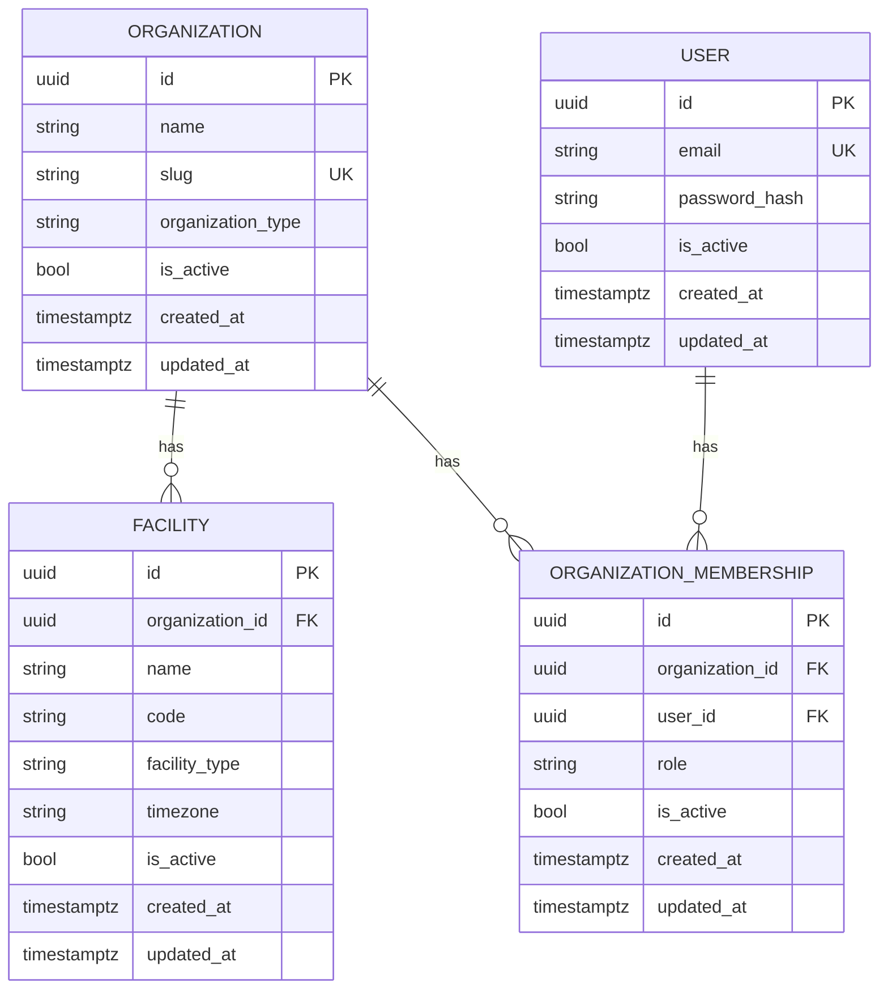

# AgentCare Domain Model

This document describes AgentCare's domain persistence model as of
STORY-004 (Identity, Membership & RBAC Foundation), building on STORY-003
(Organization & Facility Tenancy Foundation). It follows the same CURRENT
vs. PLANNED discipline as [ARCHITECTURE.md](ARCHITECTURE.md) and
[DATABASE.md](DATABASE.md): everything described here as implemented
exists in the repository and the database schema today; anything marked
PLANNED does not yet.

No CRUD API exists for `Organization`/`Facility`. A minimal, focused auth
API exists for identity (`POST /api/v1/auth/token`, `GET /api/v1/auth/me`
— see [RBAC.md](RBAC.md)); nothing else. Routes/services/repositories for
`Organization`/`Facility` themselves come in a later story.

## 1. Tenant Hierarchy & Identity



```
Organization (tenant boundary)
  ├── Facility (physical/operational location)
  └── OrganizationMembership (a User's role within this Organization)
        ↑
       User (global identity — may hold memberships in multiple Organizations)
```

**Organization** is AgentCare's tenant boundary — it represents the
customer (a hospital, clinic, hospital group, or other healthcare provider
organization). **Facility** represents a physical or operational location
belonging to exactly one Organization. **User** is a global identity, not
scoped to any one Organization. **OrganizationMembership** is the join
between a `User` and an `Organization`, carrying the `Role` that governs
what that user can do *within that organization* — see
[RBAC.md](RBAC.md) for the full identity/authorization model. Nothing
below this (patients, appointments, documents, etc.) exists yet — see
Section 14.

## 2. Organization

`app/models/organization.py` — table `organizations`.

| Column | Type | Constraints |
|---|---|---|
| `id` | UUID | primary key, application-generated (`uuid.uuid4`) |
| `name` | VARCHAR(255) | NOT NULL |
| `slug` | VARCHAR(100) | NOT NULL, UNIQUE |
| `organization_type` | VARCHAR(32) | NOT NULL, CHECK constrained to `OrganizationType` |
| `is_active` | BOOLEAN | NOT NULL, default `true` |
| `created_at` | TIMESTAMPTZ | NOT NULL |
| `updated_at` | TIMESTAMPTZ | NOT NULL |

`slug` is the stable, URL/API-friendly identifier for an organization
(distinct from its display `name`, which can change without breaking
references). Both are required — an organization must have both a human
name and a slug from creation.

## 3. Facility

`app/models/facility.py` — table `facilities`.

| Column | Type | Constraints |
|---|---|---|
| `id` | UUID | primary key, application-generated |
| `organization_id` | UUID | NOT NULL, FK → `organizations.id` (`ON DELETE RESTRICT`), indexed |
| `name` | VARCHAR(255) | NOT NULL |
| `code` | VARCHAR(50) | NOT NULL, UNIQUE together with `organization_id` |
| `facility_type` | VARCHAR(32) | NOT NULL, CHECK constrained to `FacilityType` |
| `timezone` | VARCHAR(64) | NOT NULL, validated as a real IANA timezone at the application layer |
| `is_active` | BOOLEAN | NOT NULL, default `true` |
| `created_at` | TIMESTAMPTZ | NOT NULL |
| `updated_at` | TIMESTAMPTZ | NOT NULL |

`code` is scoped to its organization, not global: two different
organizations may each have a facility coded `"MAIN"`; the same
organization may not have two facilities both coded `"MAIN"`. See Section
10.

No address or contact-information fields exist yet — deliberately, per
this story's scope. They can be added in a later migration once there's a
concrete requirement driving their shape, rather than guessed at now.

## 4. User

`app/models/user.py` — table `users`. See [RBAC.md](RBAC.md) for the
full identity/authentication model this table backs.

| Column | Type | Constraints |
|---|---|---|
| `id` | UUID | primary key, application-generated |
| `email` | VARCHAR(255) | NOT NULL, UNIQUE, normalized on assignment (Section 6) |
| `password_hash` | VARCHAR(255) | NOT NULL — Argon2id hash only; plaintext is never persisted |
| `is_active` | BOOLEAN | NOT NULL, default `true` |
| `created_at` | TIMESTAMPTZ | NOT NULL |
| `updated_at` | TIMESTAMPTZ | NOT NULL |

`User` is deliberately minimal: no date of birth, address, phone,
medical information, or other PII beyond an email address. It is **not**
scoped to an Organization — see Section 5.

## 5. OrganizationMembership

`app/models/membership.py` — table `organization_memberships`.

| Column | Type | Constraints |
|---|---|---|
| `id` | UUID | primary key, application-generated |
| `organization_id` | UUID | NOT NULL, FK → `organizations.id` (`ON DELETE RESTRICT`), indexed |
| `user_id` | UUID | NOT NULL, FK → `users.id` (`ON DELETE RESTRICT`), indexed |
| `role` | VARCHAR(32) | NOT NULL, CHECK constrained to `Role` (`admin` / `staff` / `patient`) |
| `is_active` | BOOLEAN | NOT NULL, default `true` |
| `created_at` | TIMESTAMPTZ | NOT NULL |
| `updated_at` | TIMESTAMPTZ | NOT NULL |

`UNIQUE(organization_id, user_id)` — a user may hold **at most one**
membership per organization, but may hold memberships in **multiple**
different organizations (there is no limit on how many
`OrganizationMembership` rows reference the same `user_id`, as long as
each references a different `organization_id`). This is the entire
reason `organization_id` lives on `OrganizationMembership` and not
directly on `User` — see [RBAC.md](RBAC.md) Section 1.

## 6. Email Normalization

`User.email` is normalized on assignment (`app/models/user.py`,
`normalize_email()`, applied via a SQLAlchemy `@validates` hook — the
same pattern `Facility.timezone` uses): surrounding whitespace is
trimmed, and the **entire** address is lowercased, local part included.
Lowercasing the local part is technically looser than RFC 5321 (which
permits a case-sensitive local part), but matches how virtually every
real-world mail provider and SaaS product treats addresses in practice,
and avoids user-facing login friction from a technically-correct but
surprising case mismatch.

The same `normalize_email()` function is used for both storing a new
user's email and for the login lookup
(`app.auth.service.authenticate_user`) — so the two can never silently
diverge, and `UNIQUE(email)` is enforced against the *normalized* form
(verified in `tests/models/test_user.py`).

## 7. Identifiers

All four models use **UUID primary keys generated in the application**
(`uuid.uuid4()`, via `UUIDPrimaryKeyMixin` — see
[DATABASE.md](DATABASE.md)), not database-generated ids (e.g. Postgres
`gen_random_uuid()`) and not auto-incrementing integers. This is portable
across database backends and makes the id known before the row is
inserted (useful once services/workflows need to reference an id before
committing). There is no compelling PostgreSQL-specific reason to prefer
server-side generation for any of these entities.

## 8. Ownership: The Tenant Boundary

**Organization is AgentCare's tenant boundary.** Every future tenant-owned
entity (patients, appointments, documents, workflows, etc. — none of
which exist yet) is expected to carry `organization_id`, either directly
as a column (like `Facility` and `OrganizationMembership`) or through an
explicit ownership path (e.g. a future `Appointment` might reach its
organization via `Appointment.facility.organization_id` rather than
duplicating the column on every table). See ADR-0003 for the full
tenancy decision record.

**What's enforced now, and what isn't:**

- **Enforced now, at the database/model level:** `Facility.organization_id`
  and `OrganizationMembership.organization_id` are both required, indexed
  foreign keys with `ON DELETE RESTRICT` — neither a facility nor a
  membership can exist without a valid, still-existing organization, and
  an organization with either can never be deleted out from under them by
  accident (Section 10). `OrganizationMembership.user_id` is the same:
  `ON DELETE RESTRICT` against `users.id`.
- **Enforced now, at the request-authorization level (STORY-004,
  new):** `get_current_membership` (see [RBAC.md](RBAC.md)) resolves a
  request's organization access by re-querying `OrganizationMembership`
  fresh from the database on every request — the beginning of the
  "repositories/services/auth context" enforcement layer ADR-0003
  deferred to. It is not wired into any organization-scoped *route* yet,
  because none exists (Section 14).
- **Still NOT implemented:** there is no global, automatic "tenant
  filter" that transparently scopes every query to the current user's
  organization. `get_current_membership`/`require_roles` are explicit,
  opt-in dependencies a route chooses to depend on — not a query-level
  interceptor. See ADR-0003 and ADR-0004 for why this remains a
  deliberate choice, not an oversight.

## 9. Enum Strategy

`OrganizationType`, `FacilityType`, and `Role` (all `enum.StrEnum`,
defined in their respective model modules) are deliberately small,
initial sets:

- `OrganizationType`: `hospital`, `clinic`, `hospital_group`,
  `healthcare_provider`
- `FacilityType`: `hospital`, `clinic`, `diagnostic_center`, `other`
- `Role`: `admin`, `staff`, `patient` — see [RBAC.md](RBAC.md) Section 2
  for what each means and the explicit "role is one input into
  authorization, not the complete decision" caveat.

**Persistence strategy**: all three are mapped with SQLAlchemy's `Enum` type
using `native_enum=False` (persisted as `VARCHAR` rather than a native
PostgreSQL `ENUM` type) plus `create_constraint=True` (a real database
`CHECK` constraint restricting the column to the enum's values —
verified against real PostgreSQL, e.g.
`ck_organizations_organization_type`). `values_callable` is set so the
*persisted* value is each member's lowercase `.value` (e.g. `"hospital"`),
not its uppercase Python member name (`"HOSPITAL"`) — SQLAlchemy's
default behavior for enum columns, easy to get wrong.

**Why `native_enum=False` instead of a native PostgreSQL `ENUM` type**:
adding a new value to a native PG enum requires `ALTER TYPE ... ADD
VALUE`, which has awkward transactional restrictions (in particular, the
new value can't be used in the same transaction it was added in on older
PostgreSQL versions). A `VARCHAR` + `CHECK` constraint gets the same
real enforcement, but expanding it later is an ordinary migration that
alters the constraint — no special-cased DDL.

**Enum expansion is a controlled schema + application change, not a
free-form string field**: adding a value means (1) adding it to the
Python `StrEnum`, (2) an Alembic migration altering the `CHECK`
constraint, and (3) an application release. A caller can never persist an
arbitrary string — every insert is checked against the current allowed
set, at the database level, regardless of whether it goes through the ORM
or raw SQL (verified in `tests/models/`).

## 10. Constraints & Indexes

| Constraint | Table | Purpose |
|---|---|---|
| `uq_organizations_slug` | `organizations` | Organization slugs are globally unique |
| `ck_organizations_organization_type` | `organizations` | Restricts `organization_type` to `OrganizationType`'s values |
| `fk_facilities_organization_id_organizations` (`ON DELETE RESTRICT`) | `facilities` | Every facility must reference a real, still-existing organization |
| `uq_facilities_organization_id_code` | `facilities` | Facility `code` is unique **within** an organization, not globally |
| `ck_facilities_facility_type` | `facilities` | Restricts `facility_type` to `FacilityType`'s values |
| `ix_facilities_organization_id` | `facilities` | Supports the expected "all facilities for this organization" lookup |
| `uq_users_email` | `users` | User emails are globally unique (after normalization — Section 6) |
| `fk_organization_memberships_organization_id_organizations` (`ON DELETE RESTRICT`) | `organization_memberships` | Every membership must reference a real, still-existing organization |
| `fk_organization_memberships_user_id_users` (`ON DELETE RESTRICT`) | `organization_memberships` | Every membership must reference a real, still-existing user |
| `uq_organization_memberships_organization_id_user_id` | `organization_memberships` | At most one membership per (organization, user) pair |
| `ck_organization_memberships_membership_role` | `organization_memberships` | Restricts `role` to `Role`'s values |
| `ix_organization_memberships_organization_id` | `organization_memberships` | Supports "all members of this organization" |
| `ix_organization_memberships_user_id` | `organization_memberships` | Supports "all organizations this user belongs to" — the query `get_current_membership` ([RBAC.md](RBAC.md)) runs on every request |

No indexes were added mechanically to every column — `organization_id`
on `facilities`, and both `organization_id` and `user_id` on
`organization_memberships`, are indexed individually (beyond what the
unique constraints already index) because each supports a genuinely
expected, already-identified access pattern; nothing else in this story
has one that justifies an index yet.

## 11. Relationships & Cascade Behavior

Three standard SQLAlchemy 2.x typed `relationship()` pairs (`back_populates`
on both sides in each case): `Organization.facilities` ↔
`Facility.organization`, `Organization.memberships` ↔
`OrganizationMembership.organization`, and `User.memberships` ↔
`OrganizationMembership.user`.

**Cascade behavior is deliberately conservative across all of them**:
every relationship uses SQLAlchemy's default cascade
(`"save-update, merge"`) — none includes `"delete"` or `"delete-orphan"`.
An ORM `session.delete(some_org)` or `session.delete(some_user)` will
never silently cascade-delete facilities, memberships, or (via a user)
anything else. The actual enforcement point is always the database
foreign key itself (`ON DELETE RESTRICT` — Sections 3 and 5): PostgreSQL
refuses the delete outright if any dependent row still references the
target, raising an `IntegrityError`. `passive_deletes=True` on every one
of these relationships tells SQLAlchemy to rely on that database behavior
rather than loading and manipulating the whole dependent collection
itself when a parent is deleted.

Net effect: deleting an organization that still has facilities or
members, or a user who still holds memberships, always fails loudly
rather than silently deleting everything underneath it or silently doing
nothing. Nothing in this story implements a deliberate "delete an
organization/user and everything under it" operation — that would be a
conscious future decision, not an accidental side effect of calling
`session.delete()`.

## 12. Lifecycle Semantics

`is_active` (on `Organization`, `Facility`, `User`, and
`OrganizationMembership`) is a **business status flag**, not soft
deletion. There is no query-level filtering that automatically hides
inactive rows, no deleted-at timestamp, and no soft-delete behavior
implemented anywhere in this story. A row with `is_active=False` is
exactly as present, queryable, and referenceable as one with
`is_active=True` in the database — what `is_active` means operationally
is decided at the layer that consumes it: for `User` and
`OrganizationMembership`, this story's own [RBAC.md](RBAC.md) already
decides part of it (an inactive user or an inactive membership is
rejected by `get_current_user`/`get_current_membership` — Sections 4 and
7 of that document); for `Organization`/`Facility`, it remains
undecided, left to whatever future service layer consumes them.

`created_at`/`updated_at` (via `TimestampMixin` — see
[DATABASE.md](DATABASE.md)) are set in Python, UTC, timezone-aware.
`updated_at` only refreshes for updates made through this ORM's `Session`
— a caveat inherited from the mixin, documented there.

## 13. Testing Strategy (Domain Models)

All four models' tests (`backend/tests/models/`) run exclusively against
**real PostgreSQL** (skipped unless `AGENTCARE_TEST_POSTGRES_URL` is
set), not SQLite — because nearly everything meaningful about them
(`UNIQUE`, the composite `UNIQUE(organization_id, code)` and
`UNIQUE(organization_id, user_id)`, both FKs' `ON DELETE RESTRICT`, the
`CHECK` constraints, enum persistence) is constraint-level,
database-enforced behavior that SQLite either doesn't enforce the same
way or doesn't have an equivalent syntax for at all. Each test runs
inside a savepoint that's always rolled back afterward (see
`tests/conftest.py`), so no synthetic test data is ever actually
committed to the shared development database. Coverage for
`Organization`/`Facility` (STORY-003): UUID generation, required-field
enforcement, slug/composite-code uniqueness, cross-organization code
reuse, enum persistence and round-tripping, a direct raw-SQL proof that
the `CHECK` constraints are real (not just `SQLAlchemy`-side validation),
timezone persistence and application-level timezone validation,
`is_active` defaults, and timestamp behavior. Coverage added for
`User`/`OrganizationMembership` (STORY-004): UUID generation,
required-field enforcement, email uniqueness (including *after*
normalization — Section 6), password-hash persistence (and that
plaintext is never what's stored), membership FK/uniqueness enforcement,
role persistence, a user holding memberships in multiple organizations,
`is_active` defaults, and timestamps. See [RBAC.md](RBAC.md) Section 8
and `tests/auth/` for the authentication/authorization layer's own,
separate test coverage (password hashing, JWT, the auth service, and the
`get_current_user`/`get_current_membership`/`require_roles`
dependencies — including cross-organization isolation).

## 14. Current vs. Planned Entities

**Current:** `Organization`, `Facility` (STORY-003); `User`,
`OrganizationMembership` (STORY-004).

**Explicitly not implemented yet** (belong to later stories): `Patient`
and any patient self-access rules tied to it, `Department`, `Doctor`,
`Appointment`, `Document`, `WorkflowRun`, any audit system, agents,
tools, and any CRUD API for `Organization`/`Facility` themselves. See
[RBAC.md](RBAC.md) Section 12 for the identity/authorization-specific
current-vs-planned breakdown (refresh tokens, password reset, MFA, etc.).

## 15. Planned Direction (NOT Implemented)

- A **service/repository layer** in front of these models (see
  `docs/ARCHITECTURE.md` Section 4) — nothing queries or writes these
  tables yet except the tests and the minimal auth endpoints
  (`app/api/v1/endpoints/auth.py`, which call `app.auth.service`
  directly — there is no repository abstraction yet).
- **Full authorization/tenant-scoping enforcement wired into real
  routes** — `get_current_membership`/`require_roles` exist and are
  tested (Section 8, [RBAC.md](RBAC.md)) but nothing consumes them yet,
  since no organization-scoped route exists.
- **Patient self-access rules** — deferred until a `Patient` entity
  exists to constrain access to ([RBAC.md](RBAC.md) Section 10).
- Further domain entities nested under `Facility` or `Organization`
  (patients, appointments, documents, staff profiles beyond the bare
  `User`/`OrganizationMembership` pair) — introduced by later stories as
  their own foundational work, not guessed at here.
- Soft deletion, if ever needed, would be a deliberate future decision
  with its own ADR — not implied by `is_active` (Section 12).
